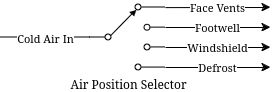

# Introduction

In this week's lab, we will be learning about two more foundational components in Strucural Verilog -- the multiplexer and demultiplexer. The names sound complicated, but the actual theory of operation is extremely simple, as usual, I am going to start with a contrived example and go from there.

# A Contrived Example

Let's take for example a car. In nearly all cases, this car will have a single air conditioning condenser, the thing that actually gets cold to chill the air entering the vehicle cabin. Side note: heat pumps are [very cool](https://en.wikipedia.org/wiki/Heat_pump) and you should learn about them since they're everywhere.

Anyway, you have a single stream of cold air coming into the HVAC system... but how does it get to the footwell? Or the face vents? Or maybe even the defroster? Well, there's that dial you can turn that changes where the stream of air goes. Depending on the car, this might move flaps with vacuum or electric motors, or any number of other methods -- but at the end of the day, this is acting as a demultiplexer:



We can see a single input coming in, and some kind of switching that routes that output to one of many different output ports. Multiplexing is the opposite operation, many separate inputs being routed via some switch to a single output. In the context of our Verilog problems, these would be incoming signals (of any width) to an output signal (or vice versa for demultiplex).

In our systems, instead of a physical dial to select the output (or input), there's typically a set of selector bits and an enable line. There are enough selector bits to describe which output (or input) to select, that is 1 bit for a 2-MUX, 2 bits for a 4-MUX, 3 bits for an 8-MUX, and so on. The enable line disables the outputs entirely when deasserted, and enables normal operation when asserted.

Let's take for example a simple 1 bit wide two input mux. We want to be able to chose which of the two input signals we assign to the output. We can describe it like this:

```verilog
module simple_2_mux(
    input A, B, Sel, Enable,
    output Y
);

    assign Y = (A & ~Sel | B & Sel) & Enable;

endmodule
```

Now, we can display its truth table like this:

| Sel | Enable | Y |
|---|---|---|
| 0 | 1 | A |
| 1 | 1 | B |
| X | 0 | 0 |

The demultiplexer would do the opposite, assigning `Y` into `A` or `B` depending on `Sel`. Similarly, 1 bit wide four input mux would look like this:

```verilog
module simple_4_mux(
    input [1:0] Sel,
    input A, B, C, D, Enable,
    output Y
);

    assign Y = (A & ~Sel[0] & ~Sel[1] |
                B &  Sel[0] & ~Sel[1] |
                C & ~Sel[0] &  Sel[1] |
                D &  Sel[0] &  Sel[1] |) & Enable;

endmodule
```

You can see here that the binary representation of `Sel` is used to select a particular input. We simply count from `00` to `11` with `Sel` to pick `A` through `D`. This scales all the way up as far as you want to go. However... what do we do when we want more than a single bit multiplexed in? We could do this:

```verilog
module simple_2_mux_2_bits(
    input [1:0] A, [1:0] B,
    input Sel,
    output [1:0] Y
);

    simple_2_mux bit0 (
        .Enable(1),
        .A(A[0]),
        .B(B[0]),
        .Sel(Sel),
        .Y(.Y[0])
    );

    simple_2_mux bit1 (
        .Enable(1),
        .A(A[1]),
        .B(B[1]),
        .Sel(Sel),
        .Y(.Y[1])
    );

endmodule
```
... and so on for more bits. But, that doesn't scale well. It feels clumsy, and while it is very structural and compositional there are better ways to do these things. Introducing... *the conditional operator*. You may be somewhat familiar with these from other languages like C or Java where they are called Ternary Statements. Let's look at one of them in Verilog below:

```verilog
module ternary_2_mux(
    input Sel,
    input A, B, Enable,
    output Y
);

    assign Y = (Sel ? B : A) & Enable;

endmodule
```

They work like this: `Condition ? True statement : False statement`. We can use this to our advantage in the higher bit count muxes. Let's see what the same 2 bit wide 2 input mux from above would look like with conditional operators:

```verilog
module ternary_2_mux_2_bits(
    input [1:0] A, [1:0] B,
    input Sel,
    output [1:0] Y
);

    assign Y = (Sel ? B : A);

endmodule
```

Woah! We don't have to decompose our input signals! We assign the entire vector of `A` or `B` into the output vector of `Y`. When the width of signals matches well, the conditioanl statement is one of the best methods to do assignments like this.

What kinds of things would we use multiplexers and demultiplexers for? Likely the most common application is bus arbitration within CPUs or other similar circuits. However, this is a fairly advanced topic, so we will stick with a more contrived example -- a really terrible Internet Service Provider.

**Hint:** For the higher count multiplexers, like the 4-MUX, the conditional statement will have to evaluate the value of the select vector. There are multiple ways to do this in verilog:

```verilog
module equivalence_check(
    input [1:0] select,
    output is_zero, is_one, is_two, is_three
);
    // Option one:
    assign is_zero  = ~select[0] && ~select[1]; // 0b00
    assign is_one   =  select[0] && ~select[1]; // 0b01
    assign is_two   = ~select[0] &&  select[1]; // 0b10
    assign is_three =  select[0] &&  select[1]; // 0b11

    // Option two:
    assign is_zero  = select == 0;
    assign is_one   = select == 1;
    assign is_two   = select == 2;
    assign is_three = select == 3;
endmodule
```

Notice the `&&` instead of `&`. The result of `&` is the two numbers bitwise-and'ed together. The result of `&&` is a boolean operation. If both sides of the `&&` are "true" (that is, nonzero), then the output is also true.

# Part 1

In this scenario you are an employee at Monopolistic Communications Company. You are the sole provider of internet in your town, and your boss has tasked you with updating the internet infrastructure. Right now, there's only a single line, connecting the CEO of the company to the local Library:

```
CEO --> Library
```

Apparently, the townsfolk (all three of them, including you), aren't happy with this situation. They all want to be able to connect to the library too! To do this, the CEO has asked you to install an Internet Valve that people can go out and switch the connection from their house onto the line. The internet connection here is slow, of course, and is only four bits of data. By the end, you will need to be able to move the four bits from the CEO, and the three other residents onto the internet line to the Library, like so:

```
CEO ----┐
You ----|
Fred----├--->Library
Jill----┘
```

Hey! That looks a lot like a multiplexer... **Task:** Implement the internet multiplexer to send four bits of data from each of the townspeople to the library with the following IO table:

| Signal | Purpose | Direction |
|---|---|---|
| sw[3:0] | CEO data | IN |
| sw[7:4] | Your data | IN |
| sw[11:8] | Fred's data | IN |
| sw[15:12] | Jill's data | IN |
| btnl | Sel[0] of the multiplexer | IN |
| btnu | Sel[1] of the multiplexer | IN |
| btnc | Enable of the multiplexer | IN |
| led[3:0] | Data at the library | OUT |

**NOTE:** DO NOT USE THE TERM `library` in your verilog code. This is a reserved keyword. Use `local_lib` instead.

The idea behind this is that you should be able to set the four switches of data corresponding to any given sender, then press & hold a combination of BTNL/U to select the source of data to the library, and see that set of LEDs light up.

# Part 2

In a shock to no one (as we've only used a multiplexer not a demultiplexer), the three other businesses in the town, the School, Fire Department, and Rib Shack also want to be able to receive information from the townsfolk. You've been asked by the CEO to now add another Internet Valve to switch the data from the townsoflk and into a given business, like so:

```
CEO ----┐     ┌---->Library
You ----|     |---->Fire Department
Fred----├-----┤---->School
Jill----┘     └---->Rib Shack
```

The updated IO table is as follows:

| Signal | Purpose | Direction |
|---|---|---|
| sw[3:0] | CEO data | IN |
| sw[7:4] | Your data | IN |
| sw[11:8] | Fred's data | IN |
| sw[15:12] | Jill's data | IN |
| btnl | Sel[0] of the multiplexer | IN |
| btnu | Sel[1] of the multiplexer | IN |
| btnd | Sel[0] of the de-multiplexer | IN |
| btnr | Sel[1] of the de-multiplexer | IN |
| btnc | Enable of the multiplexer/de-multiplexer | IN |
| led[3:0] | Data at the library | OUT |
| led[7:4] | Data at the fire department | OUT |
| led[11:8] | Data at the school | OUT |
| led[15:12] | Data at the rib shack | OUT |

With this setup you should now be able to not only switch who is sending, but who is receiving the four bits.

# Lab Deliverables

- A completed design with the above multiplexing and demultiplexing
- Demonstrate the design on the Basys3 board to the lab instructor or TA
